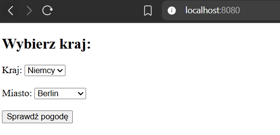
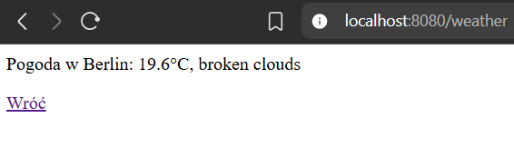

# Sprawozdanie: Zadanie 1

## Zbudowanie obrazu kontenera

```bash
docker build -t weather-app .
```

## Uruchomienie kontenera

```bash
docker run -d -p 8080:8080 -e OPENWEATHER_API_KEY=... --name weather weather-app
```

W miejscu trzech kropek należy podać swój klucz API do OpenWeather

## Uzyskanie informacji z logów

```bash
docker logs weather
```

## Sprawdzenie ile warstw posiada zbudowany obraz

```bash
docker history weather-app
```

## Sprawdzenie rozmiaru obrazu

```bash
docker images weather-app
```

# Działanie aplikacji


